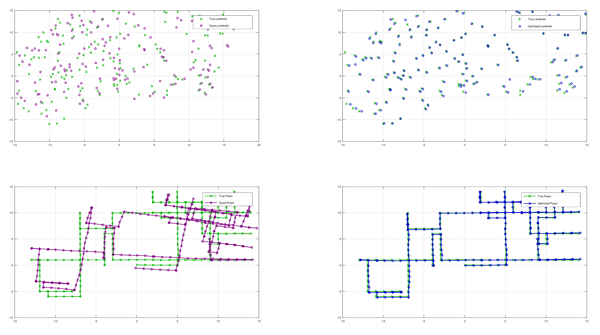
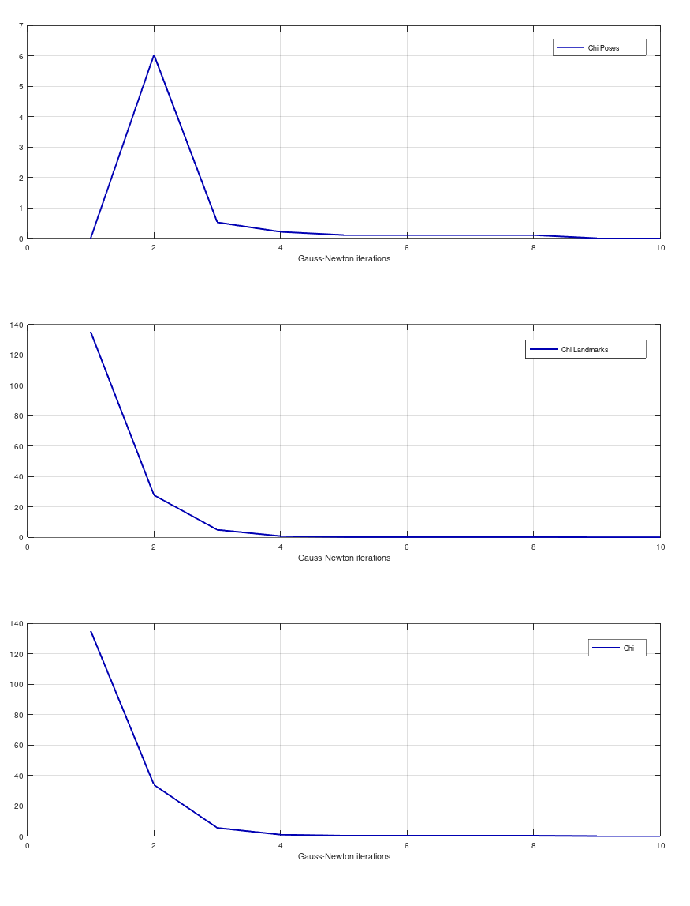
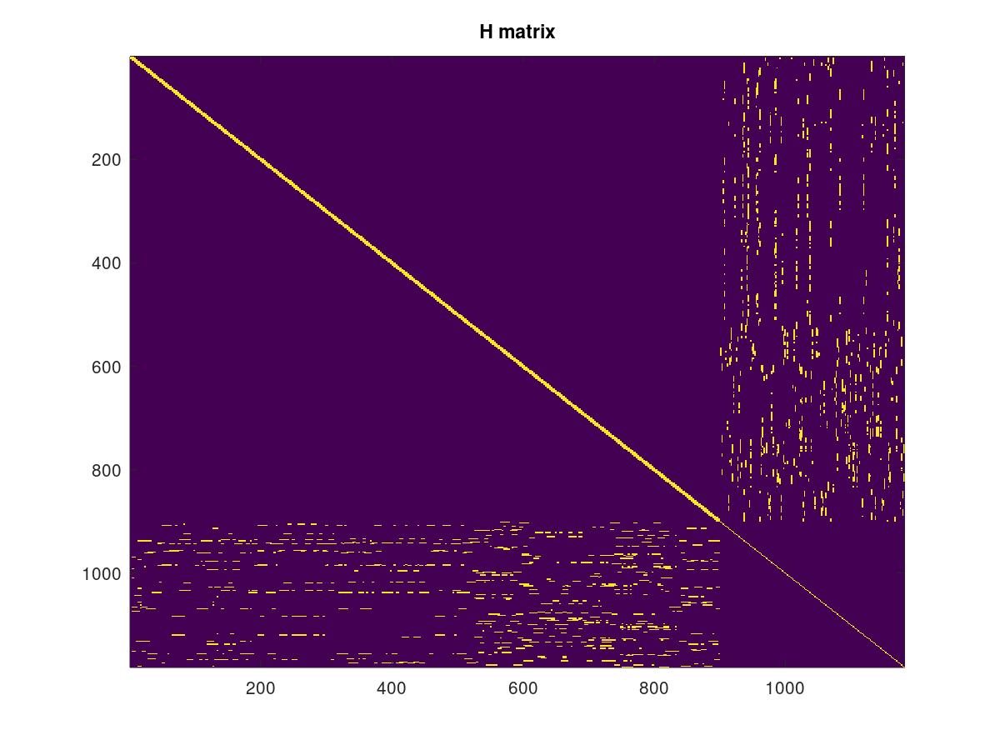

# 2D Bearing-only SLAM with Least Squares
Simultaneous localization and mapping, or **SLAM**, is the computational problem of constructing a map of an unknown environment while simultaneously estimate the robot state within it. In this particular application, landmarks measurements are assumed to be bearings, while the range measurements are not available; therefore,  landmark positions cannot be computed directly but it has to be estimated by triangulating different bearing measurements.<br>
Differently from the **Kalman filter based SLAM**, this problem will be addressed with a batch estimation technique: all the available data will be considered at once in order to compute the best solution available. Batch estimation techniques have the advantage that they treat all data with equal importance and find
optimal estimates for all model parameters given all data. This *maximum a posteriori estimation* is achieved by solving a **Least squares problem** on a non-eulidean space with **Gauss-Newton algorithm**.

## How to use it

This software has been tested on
- Ubuntu 20.04.3 LTS
- Octave 5.2.0

Run the software using:
```
$ octave-cli
$ run("2d-bearing-only-slam-least-squares.m")
```

## Results

- Top left: landmarks ground truth vs initial guess
- Top rigth: landmarks ground truth vs optimized guess
- bottom left: poses ground truth vs initial guess
- bottom right: poses ground truth vs optimized guess
<p align="center">

</p>

Evolution of Chi over iterations:
<p align="center">

</p>

Sparse structure of the H matrix:
<p align="center">

</p>
